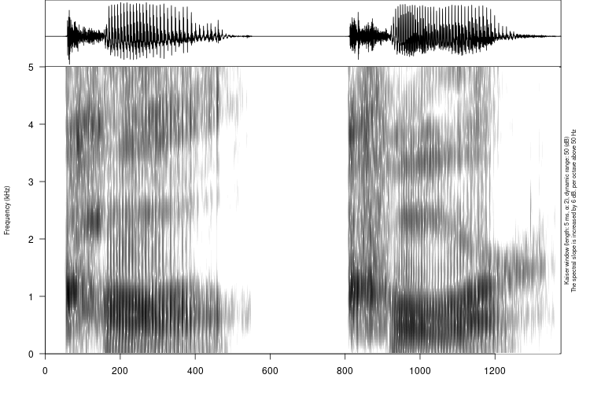
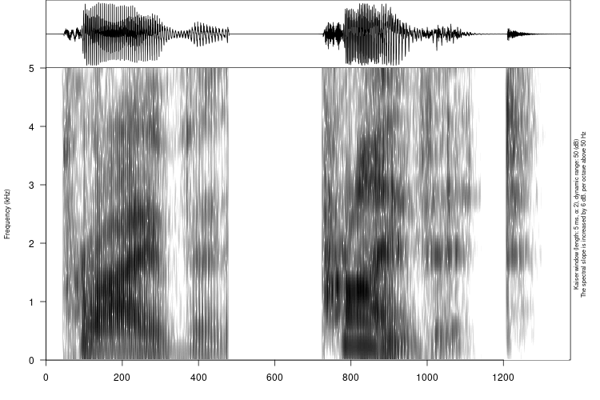
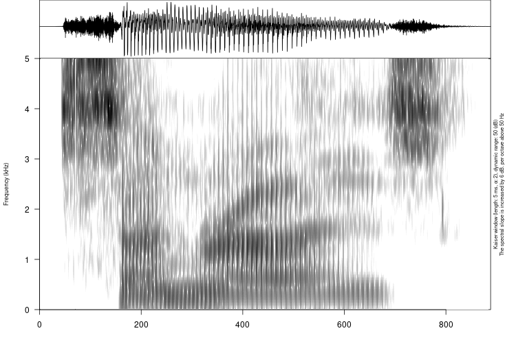

## Down and town?

## Ego and echo?

## Sin, tin and chin?

## He, fee and sea?

## Zed and set?

## Vast and fast?

## Shine and sign?

## Knock, mock and lock?

## Thing, sing and finger?

## Creep, keep and reap?

## Height, fight and hide?

## Sin, sing and seem?

## Tune and chew?

## Live and leave?

## Rate, wait and late?

## Call and core?

## They and way?

## Pay, play and lay?

## Trace and chase?

## Quit, wit, fit and bit?

## Merry and marry?

## Word and world?

## Last and lost?

## Least and list?

## Law, loo and low?

## Car

## Herb

## Butter

## Writer

## Private

## Dance

## Fragile

## Military

## Laboratory

## Fantasy, legend or myth?

## Puma, panther or panda?

## Joker, ace or jack?

## Lemon, orange or lime?

## Spanish, French or English?

## Lavender, daffodil or hyacinth?

## Antelope, elephant or opossum?

## Avocado, apple or apricot?

## Regression, aggression or depression?

## Pistachio, peanut or hazelnut?

## Sunrise, sunset or zenith?

## Tsunami, typhoon or tornado?

## Plosive, prosody or palatal?

## Vowel, voice or velar?

## Tuba, trumpet or drum?

## Satire, story or sequel?

